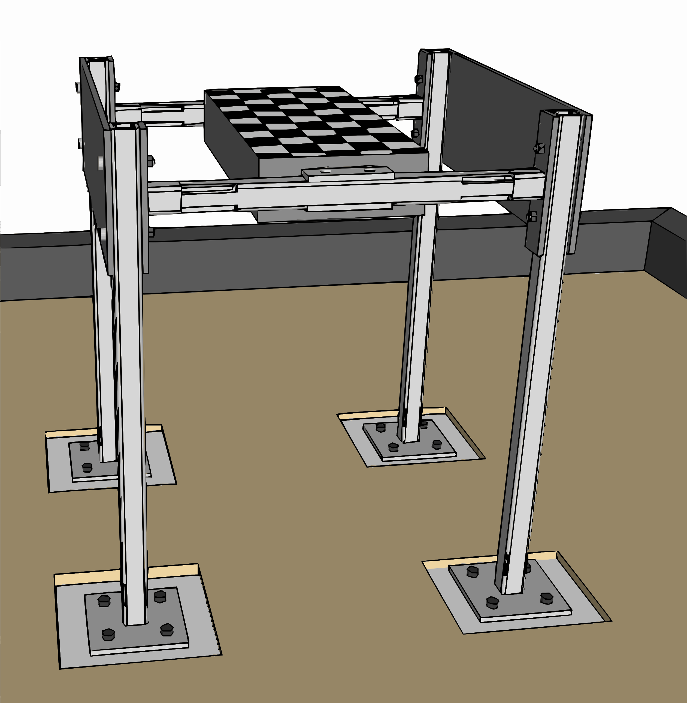
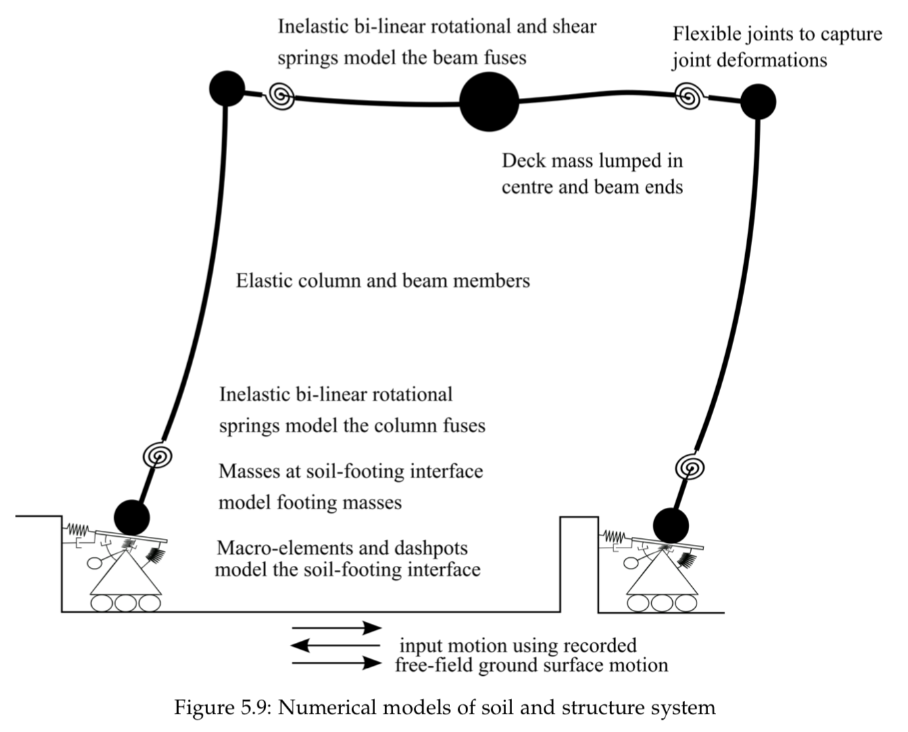

# Numerical-simulation-sfsi-one-bay-frame-experiment-
Input files for Ruaumoko3D for simulation of NEES project: 'Seismic performance assessments in dense urban environments'

Numerical study was part of doctoral thesis by Maxim Millen, supervised by Stefano Pampanin, Misko Cubrinovski and Athol Carr.

Note: The experimental tests were performed by Trombetta et al. (2013a, 2013b), not the authors of the numerical study.

## Experimental setup

The first experiment (HBM02) from the NEES project: 
”Seismic performance assessments in dense urban environments” from Trombetta et al. (2013a, 2013b), contained two model 
frame buildings sitting on 536mm (model scale). 
The centrifuge model was subject to enhanced gravitational conditions of 55g using a centrifuge. 
The one-storey and three- storey model buildings were located 0.62 m apart (34 m metres in prototype scale) 
essentially making the soil-structure-interaction effects isolated, without any cross interaction between the buildings.
 The numerical modelling of the one-storey building was a one bay frame sitting on isolated footings shown below.

Image from Millen (2016) pg 89

### Soil properties for model

|Property| Value |
|---|---|
|Name |  Nevada Sand|
|Classification | Uniform, fine sand|
|Specific gravity | 2.67|
|Mean grain size | 0.17mm|
|Coefficient of uniformity| 2.0|
|Maximum void ratio | 0.748|
|Minimum void ratio | 0.510|
|Dry unit weight | 16.4 kN/m3|
|Relative density | 80\%|
|Friction angle | 40 degrees|
|Shear modulus| 43.6 MPa |

### Ground motions used in experiments

|ID | Spin | PGA (g) | PGV (m/s) |Earthquake | 
|---|---|---|---|---|
|JOS\_L\_1 | 1 |0.14 | 0.16 | 1992 Landers| 
|TCU\_L | 1| 0.23 | 0.21 | 1999 Chi Chi| 
|RRS | 1 | 0.38 | 0.52 | 1994 Northridge| 
|PTS | 2 | 0.19 | 0.25 | 1987 Sup. Hills| 
|SCS\_L\_1 | 2 | 0.31 | 0.32 | 1994 Northridge| 
|LCN | 2 | 0.34 | 0.52 | 1992 Landers| 
|JOS\_L\_2 | 3 | 0.17 | 0.16 | 1992 Landers| 
|SCS\_L\_2 | 3 | 0.32 | 0.32 | 1994 Northridge| 
|WVC\_L | 3 | 0.40 | 0.51 | 1989 Loma Prieta| 
|SCS\_H | 3 | 0.61 | 0.77 | 1994 Northridge| 
|JOS\_H | 3 | 0.47 | 0.49 | 1992 Landers| 
|WPI\_L | 3 | 0.39 | 0.56 | 1994 Northridge| 
|JOS\_L\_3 | 4| 0.16 | 0.16 | 1992 Landers| 
|WPI\_H | 4 | 0.46 | 0.66 | 1994 Northridge| 
|PRI | 4 | 0.71 | 0.75 | 1995 Kobe| 
|TCU\_H | 4 | 0.46 | 0.35 | 1989 Chi Chi| 
|WVC\_H | 4 | 0.44 | 0.68 | 1989 Loma Prieta| 

For more information on the tests refer to Trombetta et al. (2013a, 2013b) and Mason (2011).

## Numerical model setup

Image from Millen (2016) pg 97

### Parameters used in numerical model

The frame structure was modelled in Ruaumoko3D using the soil-foundation macro-element from Millen et al. (2017)

Note: The superstructure mass and beam properties were changed throughout the experimental campaign.

|Parameter | Value | 
|---|---|
|Column height | 12.8 m|
|Beam length | 9.96 m|
|Superstructure mass  | 443 T, 368 T (per frame) |
|Fixed base period |  1.0 s, 0.88 s|
|Superstructure damping  | 2 % |
|Non-linear superstructure |  see Section 5.3.2 in Millen (2016) |
|Footing length | 4.37 m|
|Footing width |  4.37 m |
|Footing depth | 0.87 m|
|Footing embedment |  1.16 m |
|Footing mass| 522 T|
|Soil initial shear modulus | 44 MPa |
|Poisson's ratio | 0.3|
|Soil mass density  | 1700 kg/m3 |
|Friction angle | 40.0 |
|Footing axial load capacity (N_cap) | 58.0MN|
|Vertical stiffness (K_NN) | 617 MN/m|
|Horizontal stiffness (K_VV) | 504 MN/m|
|Rotational stiffness (K_MM) | 2414 MNm|
|Vertical radiation damping (C_NN) | 8.03 MNs/m|
|Horizontal radiation damping (C_VV) | 5.20 MNs/m|
|Rotational radiation damping (C_MM) | 4.47 MNms|
|Bounding surface shear parameter (mu)| 0.565 |
|Bounding surface moment parameter (psi) | 0.48 |
|Bounding surface shape parameter (xi) | 0.95 |
|Plasticity modulus factor (p_1) |  0.2| 
|Reload stiffness factor (p_2)| 1.0|
|Plastic potential shear parameter (lambda) | 2.5 |
|Plastic potential moment parameter (chi) | 3.0 |

For more information on the numerical modeling refer to Millen (2016) and Millen et al. (2017)

## References

 - Mason, H. B. (2011). Seismic Performance Assessment in Dense Urban Environments. Thesis.
(J. D. Bray, Ed.). UC Berkeley.
 - Trombetta, N. W., Benjamin Mason, H., Hutchinson, T. C., Zupan, J. D., Bray, J. D., | Kutter, B. L. (2013). 
Nonlinear Soil–Foundation–Structure and Structure–Soil–Structure Interaction: Engineering Demands. 
Journal of Structural Engineering, 04014177. http://doi.org/10.1061/(ASCE)ST.1943-541X.0001127
 - Trombetta, N. W., Mason, H. B., Hutchinson, T. C., Zupan, J. D., Bray, J. D., | Kutter, B. L. (2013). 
Nonlinear Soil–Foundation–Structure and Structure–Soil–Structure Interaction: Centrifuge Test Observations. 
Journal of Geotechnical and Geoenvironmental Engineering, 04013057. http://doi.org/10.1061/(ASCE)GT.1943-5606.0001074
 - Millen, M. D. L. (2016). Integrated Performance-based Design of Building-foundation Systems. Thesis.
(S. Pampanin, M. Cubrinovski, | A. J. Carr, Eds.). University of Canterbury
 - Millen, M. D. L., Cubrinovski, M., Pampanin, S., | Carr, A. J. (2017). 
A macro-element for the modelling of shallow foundation deformations under seismic load. 
Soil Dynamics and Earthquake Engineering, 106, 101–112. http://doi.org/10.1016/j.soildyn.2017.12.001